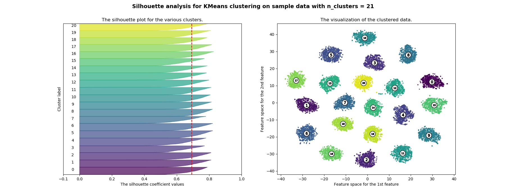
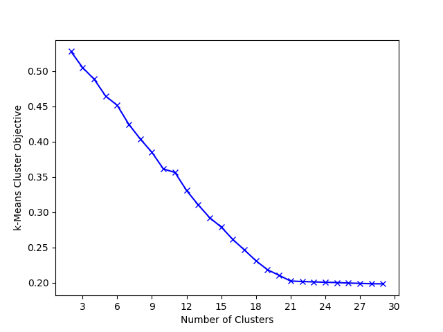

# polyglot_toolbox

Exploring polyglot word embeddings and their use in unsupervised language identification and related tasks.

## Dependencies

`pip install -r requirements.txt`

## Workflow

We expect text to be **1 document per line**, **punctuation stripped**, and **whitespace separated tokens**

We have a sample corpus created from a mixture of 21 European languages that can be downloaded [at this link](TODO).

Create a vocabulary file:

```
python main.py vocab europarl/europarl_full_noneval.txt > europarl/europarl_full_noneval.vocab.txt
```

Next, train 100-dim [FastText](https://fasttext.cc/) embeddings:

```
path/to/fasttext skipgram -input europarl/europarl_full_noneval.vocab.txt -output europarl/europarl_skipgram
```

Discover the appropriate value for `k` using either the [silhouette heuristic](https://scikit-learn.org/stable/auto_examples/cluster/plot_kmeans_silhouette_analysis.html) or the [elbow heuristic](https://en.wikipedia.org/wiki/Elbow_method_(clustering)).


Silhouette plots for values of `k` from 2 through 30:

```
python main.py discover-silhouette europarl/europarl_full_noneval.txt europarl/europarl_skipgram.bin europarl/europarl_silhouettes 30
```

Here's a silhouette plot for `k=21` which shows clear, well-separated clusters.




An elbow visualization plots the k-Means objective against values of `k`:



`k=21` is consistently picked as the right `k` value.

Finally, a k-Means model can be trained with the discovered `k` value:

```
python main.py cluster-documents europarl/europarl_full_noneval.txt europarl/europarl_skipgram.bin europarl/europarl_languages 21
```

Which will save a model in `europarl/europarl_languages_langid.joblib`. This is a scikit-learn model and language identification
is done using cluster assignment. 

You can get cluster label assignments for a full file (I'm just using a 1000 document sample) using:

```
python main.py dump-pred europarl/europarl_full_noneval.1000.txt europarl/europarl_skipgram.bin europarl/europarl_languages_langid.joblib europarl/europarl_full_noneval.1000.prediction.txt
```

As a final step, you need a human to perform the mapping from cluster number to the actual language.

## In the Wild

This technique has been successfully used in several recent papers. The involved analyses spanned multiple ethnicities,
dozens of low-resource languages, and noisy social-media text.

_Voice for the Voiceless: Active Sampling to Detect Comments Supporting the Rohingyas_<br />
[Shriphani Palakodety](https://twitter.com/shriphani), [Ashiqur R. KhudaBukhsh](https://twitter.com/khudabukhsh), [Jaime G. Carbonell](https://www.cs.cmu.edu/~jgc/)<br />
AAAI 2020

_Hope Speech Detection: A Computational Analysis of the Voice of Peace_<br />
[Shriphani Palakodety](https://twitter.com/shriphani), [Ashiqur R. KhudaBukhsh](https://twitter.com/khudabukhsh), [Jaime G. Carbonell](https://www.cs.cmu.edu/~jgc/)<br />
ECAI 2020

_Mining Insights from Large-scale Corpora Using Fine-tuned Language Models_<br />
[Shriphani Palakodety](https://twitter.com/shriphani), [Ashiqur R. KhudaBukhsh](https://twitter.com/khudabukhsh), [Jaime G. Carbonell](https://www.cs.cmu.edu/~jgc/)<br />
ECAI 2020


## Cite:

```
@inproceedings{kashmir,
  title={Hope Speech Detection: A Computational Analysis of the Voice of Peace},
  author={Palakodety, Shriphani and KhudaBukhsh, Ashiqur R. and Carbonell, Jaime G},
  booktitle={Proceedings of ECAI 2020},
  pages={To appear},
  year={2020}
}
```

